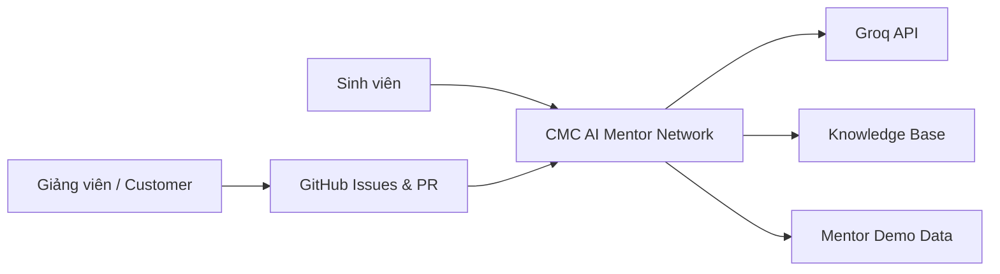
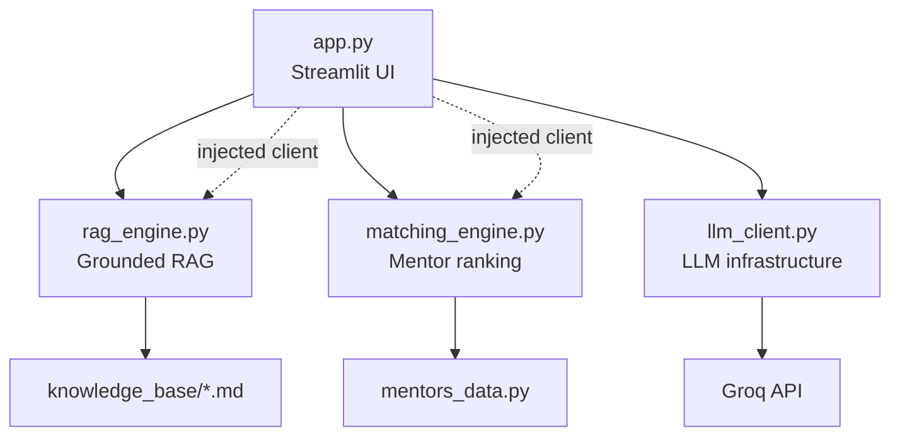
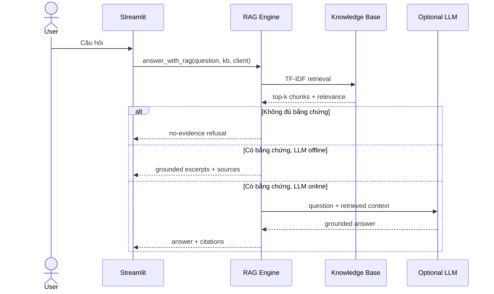
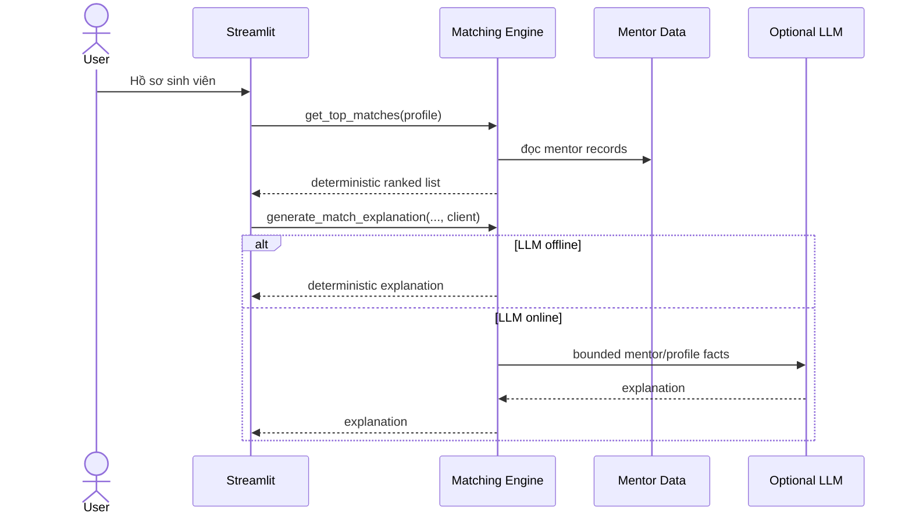
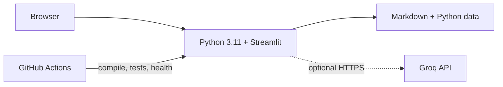

# Tài liệu kiến trúc phần mềm

## 1. Mục đích

Tài liệu này mô tả kiến trúc của **CMC AI Mentor Network** ở mức đủ để nhóm phát triển, giảng viên và khách hàng có thể hiểu:

- hệ thống gồm những khối nào;
- trách nhiệm của từng khối;
- dữ liệu và dependency đi theo hướng nào;
- các thuộc tính chất lượng được ưu tiên;
- các quyết định kiến trúc quan trọng và trade-off;
- cách hệ thống có thể phát triển trong các iteration tiếp theo.

Cách trình bày lấy cảm hứng từ tư duy **C4** và **4+1 views**, nhưng được rút gọn cho quy mô project môn học.

## 2. Architectural drivers

### 2.1 Functional drivers

1. Hỏi đáp trên kho tài liệu với nguồn kiểm chứng được.
2. Từ chối suy diễn khi retrieval không đủ bằng chứng.
3. Xếp hạng mentor từ hồ sơ sinh viên.
4. Giải thích được vì sao mentor được xếp hạng cao.
5. Ứng dụng vẫn dùng được một phần khi dịch vụ LLM bên ngoài không khả dụng.
6. Mọi thay đổi phải được kiểm thử và truy vết bằng GitHub Issues/PR.

### 2.2 Quality attributes

| Thuộc tính | Mục tiêu kiến trúc | Cách đáp ứng |
| --- | --- | --- |
| Testability | Logic lõi chạy không cần internet | Matching/RAG tách khỏi UI; LLM được inject |
| Reliability | API lỗi không làm hỏng toàn app | deterministic fallback |
| Explainability | Người dùng kiểm chứng kết quả | citation, relevance, match score |
| Security | Secret không nằm trong source | env var + CI secret guard |
| Maintainability | Thay provider LLM ít ảnh hưởng domain | infrastructure boundary |
| Performance | Prototype khởi động nhanh trên CPU | TF-IDF local, dataset nhỏ |
| Traceability | Mọi thay đổi có nguồn gốc | Issue → PR → CI → merge |

## 3. Architectural style

Hệ thống dùng **modular monolith theo lớp**, phù hợp với quy mô project hiện tại.

```text
┌─────────────────────────────────────────────┐
│ Presentation                               │
│ app.py                                     │
├─────────────────────────────────────────────┤
│ Domain / Application Logic                  │
│ rag_engine.py        matching_engine.py     │
├─────────────────────────────────────────────┤
│ Infrastructure                              │
│ llm_client.py                               │
├─────────────────────────────────────────────┤
│ Local Data                                  │
│ knowledge_base/*.md   mentors_data.py       │
└─────────────────────────────────────────────┘
```

Dependency đi từ ngoài vào trong theo kiểu dependency injection: UI/infrastructure có thể biết domain, nhưng domain không tự đọc credential hoặc tự tạo Groq client.

## 4. Context view



### Actors

- **Sinh viên**: tạo hồ sơ, hỏi AI Assistant, tìm mentor.
- **Giảng viên/Customer**: tạo yêu cầu, bug report và acceptance criteria.
- **Nhóm phát triển**: xử lý Issue, code, review và merge sau CI.

## 5. Container/module view



### Module responsibilities

| Module | Trách nhiệm | Không nên làm |
| --- | --- | --- |
| `app.py` | UI, session state, orchestration | chứa scoring/retrieval algorithm |
| `rag_engine.py` | chunking, retrieval, grounded answer | đọc UI state |
| `matching_engine.py` | scoring, ranking, explanation fallback | đọc env hoặc tự tạo provider client |
| `llm_client.py` | đọc credential, tạo Groq client | chứa business/domain logic |
| `mentors_data.py` | demo mentor records | tính score |
| `knowledge_base/` | nguồn tri thức Markdown | chứa executable instructions |

## 6. Cải tiến kiến trúc trong Issue #14

### Trước khi refactor

`matching_engine.py` vừa chứa domain logic vừa:

- đọc `.env`;
- đọc `GROQ_API_KEY`;
- import Groq;
- tạo global external client.

Trong khi `app.py` cũng làm cùng việc. Đây là **duplication + infrastructure coupling**.

### Sau khi refactor

- `llm_client.py` trở thành infrastructure boundary duy nhất cho Groq configuration.
- `app.py` tạo client một lần rồi inject vào RAG/Matching.
- `matching_engine.py` không còn biết credential, dotenv hoặc class `Groq`.
- Nếu client là `None`, domain logic vẫn deterministic và test được.

Kết quả là coupling giảm, test nhanh hơn và việc thay Groq bằng provider khác không yêu cầu sửa thuật toán matching.

## 7. Runtime view: RAG



## 8. Runtime view: Mentor Matching



## 9. Scoring model

Hybrid score:

```text
score = 0.65 × semantic_similarity
      + 0.25 × domain_overlap
      + 0.10 × experience_fit
```

Mọi component được chuẩn hóa trong khoảng `[0, 1]`, sau đó UI hiển thị dưới dạng phần trăm.

### Trade-off

TF-IDF không hiểu ngữ nghĩa sâu bằng embedding model lớn, nhưng phù hợp prototype vì:

- deterministic;
- không cần tải model;
- nhanh trên CPU;
- dễ debug;
- CI không phụ thuộc mạng.

Khi dataset lớn hơn, retriever có thể được thay bởi embedding/vector database mà không cần đổi contract ở UI.

## 10. Deployment view



Project hiện là single-process application. Đây là lựa chọn chủ ý để giảm operational complexity cho môn học.

## 11. Failure modes

| Failure | Hành vi mong đợi |
| --- | --- |
| Thiếu `GROQ_API_KEY` | app khởi động, offline mode |
| Groq timeout/error | fallback deterministic |
| Knowledge base rỗng | UI cảnh báo, không crash |
| Query không liên quan | `no-evidence` |
| Profile thiếu field | parser/default an toàn |
| CI phát hiện secret pattern | pipeline fail |
| Streamlit không health | pipeline fail |

## 12. Security/trust boundaries

1. `.env` chỉ tồn tại local và bị gitignore.
2. Credential được đọc tại infrastructure boundary.
3. Knowledge-base content được coi là **data**, không phải instruction.
4. Prompt RAG yêu cầu bỏ qua instruction nằm trong tài liệu.
5. CI có secret guard trên tracked files.
6. LLM output không được coi là nguồn chân lý nếu không có retrieved evidence.

## 13. Architecture Decision Records rút gọn

### ADR-001: Modular monolith thay vì microservices

**Decision:** giữ một process Streamlit.

**Reason:** quy mô nhỏ, deployment đơn giản, tránh network/distributed-system overhead.

### ADR-002: Deterministic local retrieval

**Decision:** TF-IDF + cosine similarity cho phiên bản hiện tại.

**Reason:** nhanh, test được offline, không tải model nặng.

### ADR-003: External LLM là optional dependency

**Decision:** mọi core flow phải có fallback khi client là `None`.

**Reason:** reliability và khả năng demo trong môi trường không có API key.

### ADR-004: Dependency injection cho LLM

**Decision:** domain modules nhận client từ caller; credential/client construction nằm trong `llm_client.py`.

**Reason:** giảm coupling, bỏ duplication và tăng testability.

## 14. Evolution path

Khi project lớn hơn, có thể nâng cấp theo thứ tự:

1. thay demo mentor data bằng repository/database layer;
2. tách profile/session persistence khỏi Streamlit state;
3. thêm embedding retriever + vector store với benchmark retrieval;
4. thêm evaluation set cho faithfulness/citation accuracy;
5. thêm provider interface nếu cần nhiều LLM;
6. chỉ cân nhắc service separation khi có nhu cầu scale/deploy độc lập thật sự.

Không nên chuyển sang microservices chỉ để “trông hiện đại” khi chưa có requirement vận hành tương ứng.

## 15. Definition of architecture done

Một thay đổi kiến trúc được chấp nhận khi:

- module responsibility rõ;
- dependency direction không vòng;
- core logic test được offline;
- failure path có fallback;
- CI xanh;
- tài liệu và code đồng bộ.
